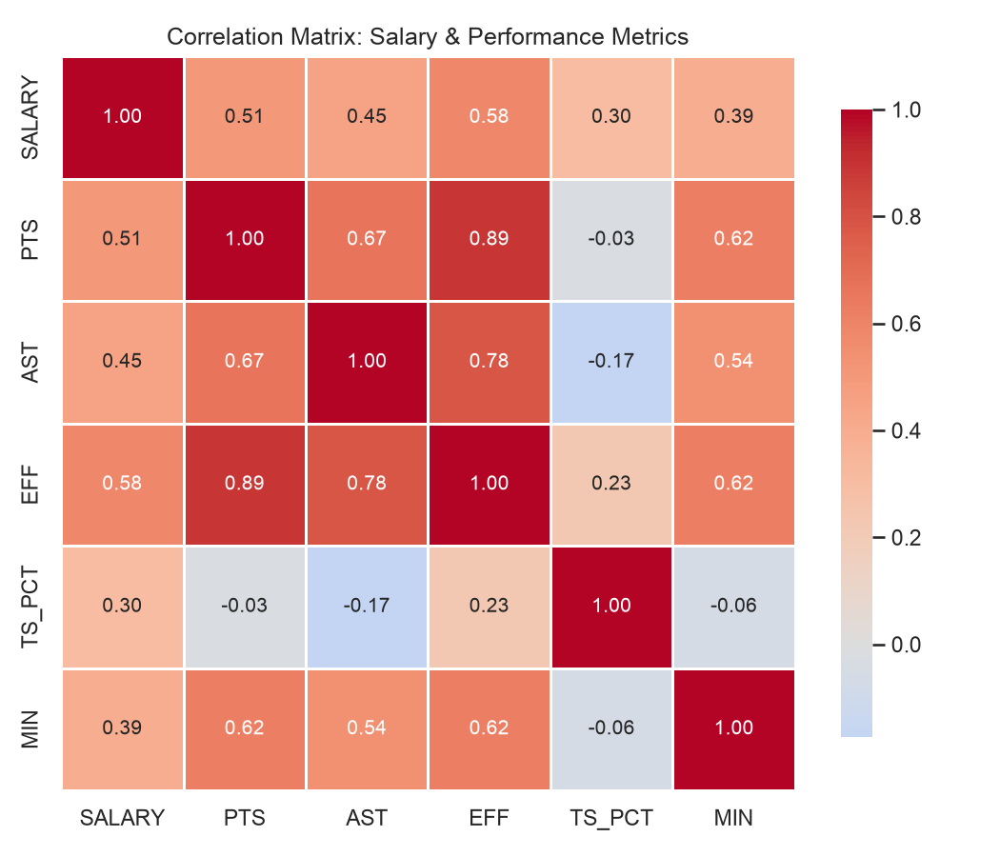
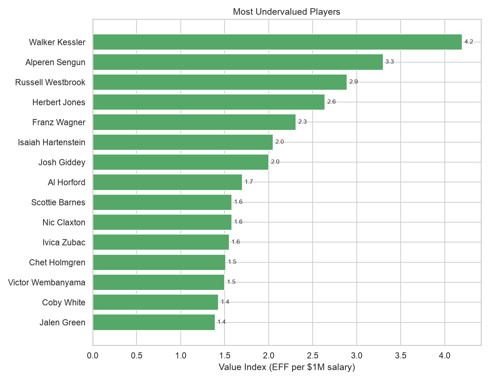
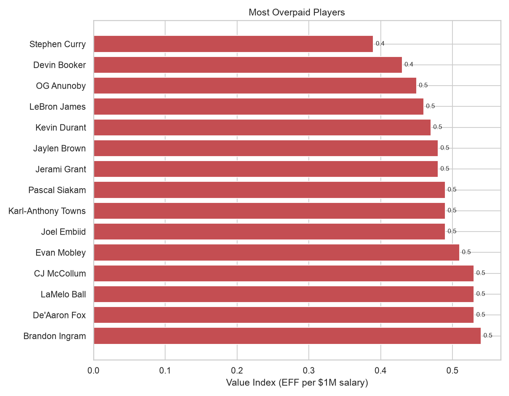
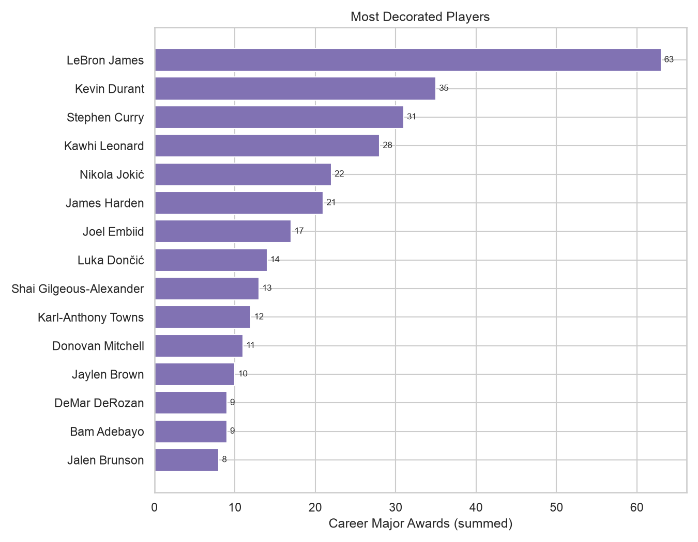
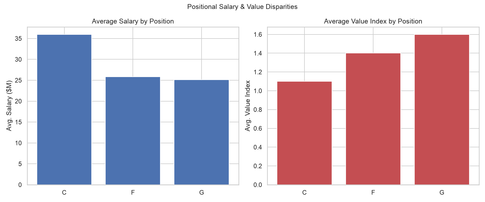

# Chart Guide

What each chart in this project shows, with the real numbers behind it. Regenerate all six with `python main.py`; these come from the bundled 2025-26 dataset, top 80 scorers.

## Salary vs. On-Court Performance

Each dot is one of the 80 highest-scoring players in the 2025-26 season. Salary runs along the x-axis, EFF along the y-axis, dot size tracks points per game, and color marks position: guard, forward, or center.

The two variables correlate at 0.62, real but loose. Nikola Jokić sits at the top: a $55.2M salary paired with an EFF of 41.0, the highest mark here. Victor Wembanyama, three seasons into a rookie-scale deal worth $13.4M, posts a 31.8, closer to Jokić's number than to what his own paycheck would predict. Dots thin out below $10M but don't disappear. Jalen Duren earns $6.5M and posts a 26.2, a better mark than half of the ten highest-paid players on this chart.

## Correlation Matrix

Eight stats, checked against each other: salary, points, rebounds, assists, EFF, true shooting percentage, minutes, and career major awards (MVP, DPOY, ROY, Most Improved, Finals MVP, championships, All-Star, All-NBA, All-Defensive, and All-Rookie selections, summed into one number). Darker red means a stronger positive relationship.

Points correlate with salary at 0.68, the strongest link in the table. Career awards land at 0.60, close behind: how decorated a player already is predicts his paycheck almost as well as what he's doing on the floor this season. Rebounds barely move the number at 0.24. True shooting percentage moves it even less, at 0.20. Teams pay for scoring and reputation. Shooting efficiency on its own buys much less.

## Most Undervalued Players

Fifteen players, ranked by Value Index (EFF per $1M of salary). Collin Gillespie leads at 6.49: a $2.3M salary against an EFF of 14.9. Jalen Duren sits ninth at 4.04, posting a 26.2 EFF on a $6.5M deal. Victor Wembanyama closes out the list at 2.38, the only player on it earning more than $10M, and the only one whose raw EFF (31.8) tops everyone else here.

Twelve of these fifteen players carry one or fewer career major awards, three of them none at all. Value Index rewards production relative to cost, and young, inexpensive players win that math almost by default.

## Most Overpaid Players

The same ranking, flipped: the highest earners returning the least EFF per salary dollar. Stephen Curry sits at the bottom at 0.39, a $59.6M salary against a 23.3 EFF. Devin Booker, OG Anunoby, LeBron James, and Kevin Durant follow within a few hundredths of him, each earning more than $39M.

Fourteen of these fifteen players have won at least one career major award; LeBron carries 63. The exception is Jerami Grant, who lands here on box-score production alone, no accolades, $32M this season, an EFF of 15.4. For the other fourteen, the salary prices in what a box score can't: name recognition, playoff pedigree, the ability to sell out an arena on a Tuesday in January. A rookie on a $2M deal can post a better Value Index than Curry without coming within miles of his value to a franchise.

## Most Decorated Players

Fifteen bars, ranked by career major awards. LeBron James leads at 63, nearly double Kevin Durant's 35, the next-highest total on the list. Jalen Brunson closes it out at 8. Every player here has made at least three All-Star teams.

The ranking reflects accolades accumulated over an entire career. Six of these fifteen players, including LeBron, Curry, and Durant, also show up in the overpaid chart above: a résumé built over a decade gets priced into a contract long before this year's stat line is final.

## Positional Salary & Value Disparities

Three bars per panel, guards, forwards, and centers, averaged across the same 80 players. Left panel: average salary. Right panel: average Value Index.

Centers earn the most per player, $36.0M on average, and return the least value, 1.1. Guards earn the least, $25.2M, and return the most, 1.6. Only nine centers make this top-80 cut at all, against 32 forwards and 39 guards. Scoring volume runs through guards and wings this season, and the position with the fewest top scorers still carries the highest average salary: centers get paid a premium for scarcity, not for outproducing everyone else.
