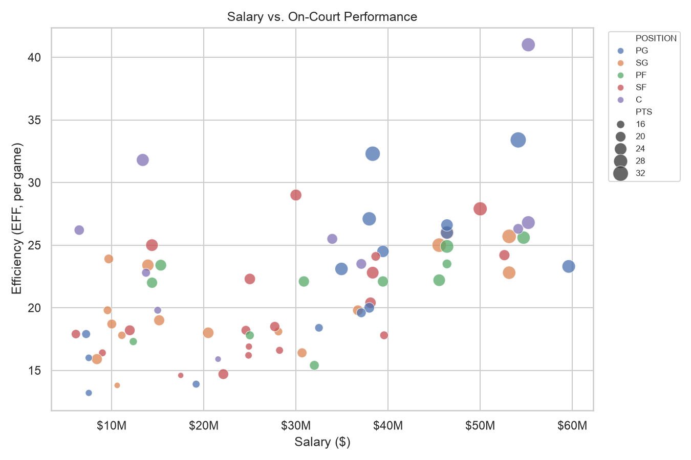

# NBA Player Performance Analytics

Analyzes the relationship between NBA player salaries and on-court performance for the
2025-26 season, using real per-game box scores and real salary/position data. Computes
advanced metrics (True Shooting %, an efficiency score, a salary-adjusted "Value Index"),
runs a correlation analysis, and produces four charts.



## Quickstart

```bash
pip install -r requirements.txt

python main.py                # bundled real 2025-26 box scores, offline, top 80 scorers
python main.py --live-data    # re-fetch current stats from the NBA Stats API instead
```

Other options:

```bash
python main.py --top-n 200          # widen to the top 200 scorers instead of 80
python main.py --skip-viz           # skip chart generation, just produce the CSV
python main.py --live-data --season 2024-25   # a different season, fetched live
```

Output lands in `output/`: `processed_player_data.csv` plus four PNG charts.

## Data sources

- **`data/nba_dailyleaders_2025_26.csv`** — real per-game box scores for the 2025-26
  season (582 players, 26,651 game rows), pulled from the NBA Stats API's `LeagueGameLog`
  endpoint and bundled so the project runs offline by default.
  `analysis.aggregate_season_stats()` collapses it into one season-average row per player.
- **`data/nba_salaries_2025_26.csv`** — real 2025-26 salaries for 240 players, parsed
  from a plain-text salary export (rank/name/team/salary). The `POSITION` column is a
  traditional PG/SG/SF/PF/C label assigned by hand for each of the 240 players — the NBA
  Stats API itself only reports broad G/F/C (or hybrids like "G-F"), it hasn't tracked
  the classic 5-position breakdown in years, so no live source has this. Treat it as each
  player's primary position, not a precise per-possession classification (plenty of
  players — Draymond Green, Domantas Sabonis, etc. — genuinely play multiple spots).
- **`--live-data`** re-fetches current per-game stats from the NBA Stats API instead of
  the bundled file — useful for a different season or the latest games. If that call
  fails, `main.py` catches `LiveDataUnavailable` and falls back to the bundled file
  automatically.

## How it works

1. **Aggregate** — box-score rows are grouped by player: games played, season-total
   points (used for ranking), and per-game averages for every stat.
2. **Select top N** — `analysis.select_top_players()` keeps the top 80 players (`--top-n`
   to change it) ranked by total season points, before the salary join.
3. **Merge salary** — joined by player name, normalized to survive accents, periods, and
   suffixes (e.g. `Nikola Jokić` vs `Nikola Jokic`, trailing `Jr.`/`III`). Players with no
   salary match are dropped and the count is reported.
4. **Metrics** (`analysis.compute_advanced_metrics`):
   - **TS%** — `PTS / (2 * (FGA + 0.44 * FTA))`, the standard shooting-efficiency formula.
   - **EFF** — a simplified per-game efficiency score (PTS + REB + AST + STL + BLK minus
     missed shots and turnovers), the same idea as the NBA's official "EFF" stat.
   - **Value Index** — `EFF / (salary in $M)`. Higher means more production per dollar.
5. **Output** — a correlation matrix (salary vs. PTS/REB/AST/EFF/TS%/MIN), a top-15
   "most undervalued players" table, and four charts (`visualizations.py`).

## Example output

| Chart | What it shows |
|---|---|
| `salary_vs_performance.png` | Scatter of salary vs. efficiency, colored by position |
| `correlation_heatmap.png` | Correlation matrix across salary and performance stats |
| `top_value_players.png` | Players with the highest production per salary dollar |
| `position_breakdown.png` | Average salary and Value Index by position |

More examples in [`examples/`](examples/), generated from the bundled dataset so they're
reproducible without a live API call.

## Project structure

```
main.py             CLI entry point
analysis.py         data loading, aggregation, merging, metric calculations
visualizations.py   chart generation
data/
  nba_dailyleaders_2025_26.csv   real 2025-26 per-game box scores (582 players)
  nba_salaries_2025_26.csv       real 2025-26 salary + position data (240 players)
output/              generated CSV + charts (gitignored)
examples/            committed example charts from the bundled dataset
```

## Caveats

- The salary file covers 240 notable players; about 9 of the top 80 scorers by points
  don't have a salary entry (recent rookies not yet in the export, or name variants the
  normalizer doesn't catch) and are dropped from the salary-linked analysis.
- Positions are hand-assigned (see Data sources above) rather than pulled from a live
  feed, since the traditional 5-position breakdown doesn't exist in official NBA data
  anymore.
- The bundled box score log is a point-in-time snapshot — it won't include games played
  after it was pulled. Use `--live-data` for the latest numbers.
- The NBA Stats API is undocumented and can change or rate-limit without notice; that's
  what the `--live-data` fallback path is for.
